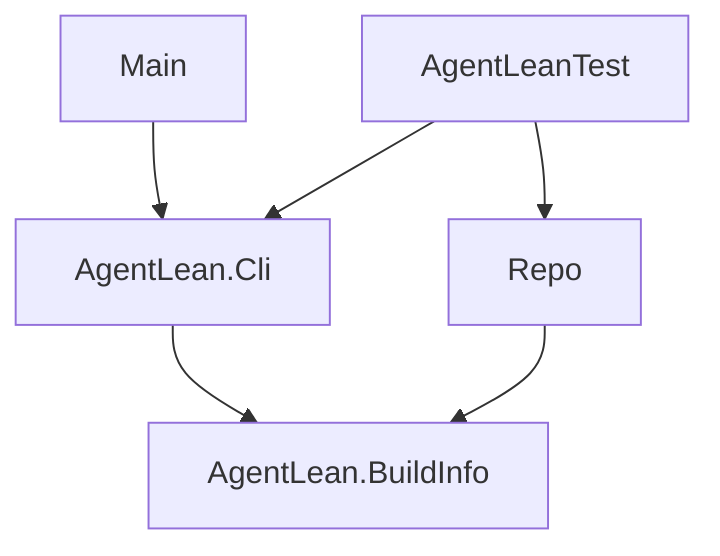

# Architecture

This page maps the [specification](spec.md) onto Lake targets and modules and owns their
boundaries. Behavior lives in the specification; update this page in the same change that adds a
module, a library or an import edge.

## Repository layout

```text
agent-lean/
|-- AgentLean.lean           library root: imports every product module
|-- AgentLean/
|   |-- BuildInfo.lean       build identity: name, version, repository, target
|   `-- Cli.lean             command-line contract: parse, usage, streams, exit codes
|-- Main.lean                process wiring: `main` calls AgentLean.Cli.run
|-- AgentLeanTest/           `lake test`: Fixture plus one test module per module tested
|-- scripts/
|   |-- Repo.lean            tooling library root
|   `-- Repo/                Main (`lake exe repo`), Plan/, Links, Style, Markdown, Tree,
|                            Dist, Process
|-- docs/design/             specification, architecture, capability page template
|-- docs/impl/               plan.md, current.md, current/, records/
|-- docs/guide/              planning workflow, development guide
|-- .github/workflows/       ci.yml (build, test, lint, dist); release.yml (tag -> release)
|-- AGENTS.md                canonical agent rules; CLAUDE.md, GEMINI.md, .cursor/ point to it
|-- lakefile.toml            targets, options, test and lint drivers
|-- lake-manifest.json       locked dependencies (none yet)
`-- lean-toolchain           pinned Lean release
```

Add directories only when needed: `AgentLean/<Area>/` when a module splits, a second
`[[lean_exe]]` for another command, `AgentLeanTest/testdata/` for committed test inputs.

## Import direction



- `Main` imports only `AgentLean` and calls `AgentLean.Cli.run`.
- `Cli` is the only module that reads arguments, writes to stdout or stderr, or decides an exit
  code. It builds typed input and passes it down.
- Product modules never import `Cli`, `Repo` or `AgentLeanTest`. Imports between them follow the
  edges drawn here; draw a new edge before adding the `import`. Lean rejects cycles.
- `Repo` may import product modules for shared facts such as the version; `AgentLeanTest` may
  import anything except `Main`.

## Growing the package

The product starts as one library because modules are cheaper than packages. Split a module into
`AgentLean/<Area>/` modules when it passes about 300 lines, keeping `AgentLean/<Area>.lean` as the
import point. Move code into its own Lake package under `packages/<name>/`, required by path, only
when another project consumes it or it needs its own dependencies; then redraw the graph above.

## Runtime model

- `main` receives the arguments without the program name, passes them with the stdout and stderr
  streams to `Cli.run`, and exits with the `UInt32` it returns.
- `Cli.run` parses into a `Command`: requested help goes to stdout with `0`, usage errors to
  stderr with `2`. It runs the command and renders an `IO` error on stderr with `1`.
- The process is single-threaded. A capability that needs parallel work uses `IO.asTask` owned by
  the function that starts it, waits for every task, and keeps output order deterministic.
